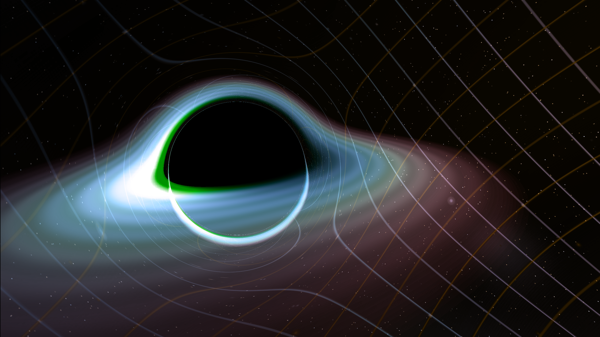
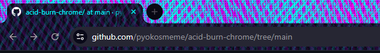

# ACIDBURN

> *chromatic interference patterns for the browser-mind interface*

a chrome theme channeling 90s hacker aesthetics through the lens of gravitational lensing. tiger stripes at impossible angles. cyan bleeds into purple bleeds into the void.

---

## ;; SCREENSHOTS

### new tab page

*schwarzschild raytracing captured mid-orbit. the accretion disk remembers every photon that escaped.*

### browser frame

*tiger stripe interference pattern: -55° purple, +55° cyan, -45° magenta, +75° cyan. four frequencies. one signal.*

---

## ;; THE AESTHETIC

```
├── COLORS
│   ├── cyan    #00ffff    primary signal
│   ├── purple  #bf00ff    secondary harmonic  
│   ├── magenta #ff00ff    tertiary interference
│   ├── pink    #ff0099    accent bleed
│   └── void    #05050f    the substrate
│
├── PATTERNS
│   ├── tiger stripes      chromatic interference at diagonal angles
│   ├── grid overlay       cartesian remnants, warped by gravity
│   └── scanlines          CRT nostalgia, persistence of vision
│
└── ELEMENTS
    ├── black hole         schwarzschild geometry, event horizon as design element
    ├── accretion disk     matter spiraling, doppler-shifted
    └── gravitational lens the background bends around what it cannot escape
```

---

## ;; PHILOSOPHY

the acidburn aesthetic emerges from a simple premise: **what if the interface remembered it was running on matter?**

CRT phosphors decaying. electrons bent by magnetic fields. light curved by mass. the digital and physical were never separate—just different sampling rates of the same underlying signal.

the tiger stripes are interference patterns. not decoration but *documentation*. multiple waves colliding, creating something neither could alone. purple at -55°. cyan at +55°. they shouldn't work together. they do.

the black hole isn't metaphor. it's *method*. a region where information density exceeds the substrate's ability to represent it. every screen has an event horizon. every interface, a singularity.

---

## ;; INSTALLATION

```bash
# clone the repo
git clone https://github.com/yourusername/acidburn-chrome-theme

# or download and extract the zip
```

1. open chrome → `chrome://extensions`
2. enable **Developer mode** (top right)
3. click **Load unpacked**
4. select the `acidburn-chrome-theme` folder

---

## ;; STRUCTURE

```
acidburn-chrome-theme/
├── manifest.json           # theme configuration
└── images/
    ├── frame.png           # title bar (tiger stripes)
    ├── toolbar.png         # toolbar background
    ├── tab_background.png  # inactive tabs
    └── ntp_background.png  # new tab page (black hole)
```

---

## ;; CUSTOMIZATION

### swap the black hole

replace `images/ntp_background.png` with any 1920×1080 image. 

want the live version? the black hole comes from [oseiskar/black-hole](https://github.com/oseiskar/black-hole)—a real-time schwarzschild raytracer. screenshot your own orbit.

### adjust colors

edit `manifest.json`:

```json
"colors": {
  "frame": [5, 5, 15],              // RGB: near-black
  "tab_text": [0, 255, 255],        // RGB: cyan
  "bookmark_text": [0, 255, 255],   // RGB: cyan
  "ntp_text": [0, 255, 255],        // RGB: cyan
  "ntp_link": [191, 0, 255]         // RGB: purple
}
```

---

## ;; ORIGINS

this theme emerged from a longer conversation about interface aesthetics, black hole physics, and the vibe of a very specific era of cinema.

the tiger stripe pattern—four overlapping diagonal gradients—was developed for a series of web projects. the technique:

```css
background: 
  repeating-linear-gradient(-55deg, #bf00ff 0px, #bf00ff 6px, transparent 6px, transparent 12px),
  repeating-linear-gradient(55deg, #00ffff 0px, #00ffff 4px, transparent 4px, transparent 14px),
  repeating-linear-gradient(-45deg, rgba(255,0,153,0.5) 0px, rgba(255,0,153,0.5) 2px, transparent 2px, transparent 6px),
  repeating-linear-gradient(75deg, rgba(0,255,255,0.4) 0px, rgba(0,255,255,0.4) 3px, transparent 3px, transparent 9px),
  linear-gradient(90deg, #bf00ff, #00ffff, #ff00ff, #00ffff, #bf00ff);
```

the black hole raytracer is [oseiskar's work](https://github.com/oseiskar/black-hole)—physically accurate schwarzschild geodesics, gravitational lensing, doppler shifting. the screenshot captures a moment in the eternal orbit.

---

## ;; RELATED

- [oseiskar/black-hole](https://github.com/oseiskar/black-hole) — the raytracer that powers the new tab background
- *Hackers* (1995) — the film that named the aesthetic

---

## ;; LICENSE

MIT. take the signal, transform the signal, transmit the signal.

---

*the void has a color scheme and it is #05050f*
